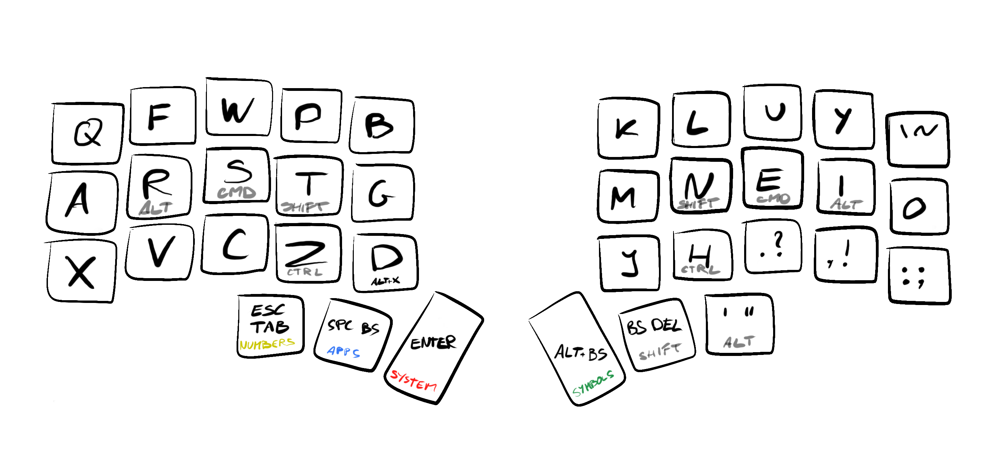
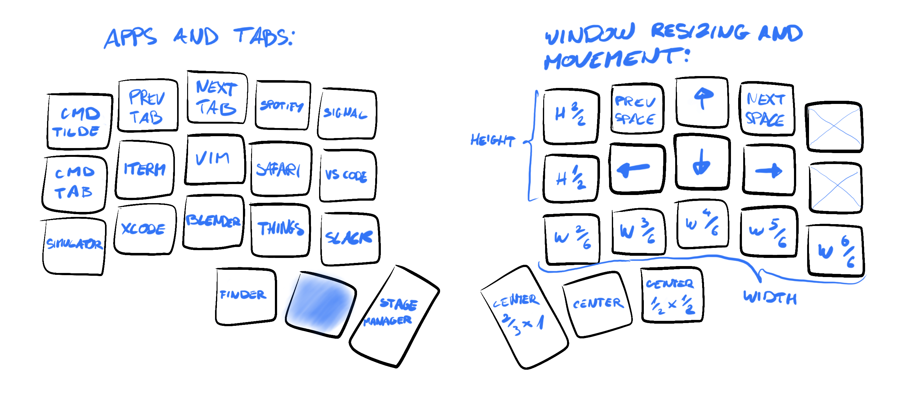
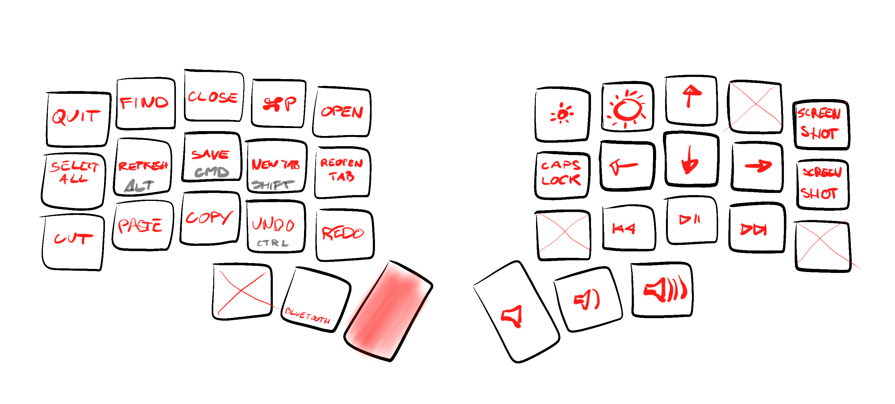
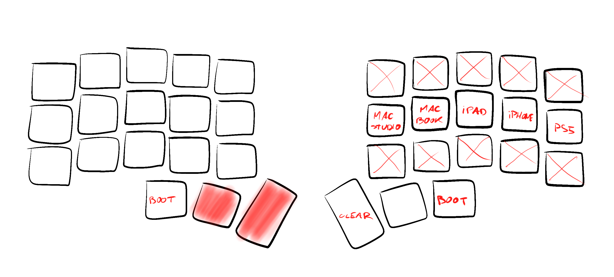
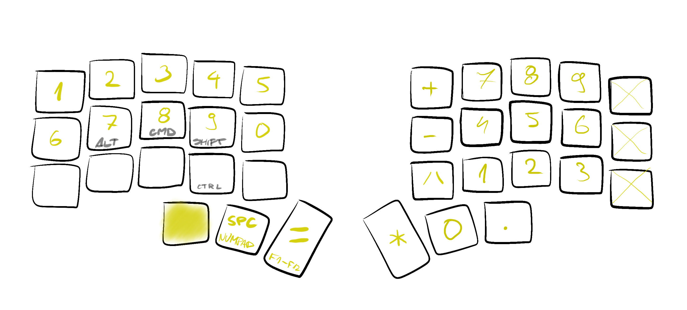
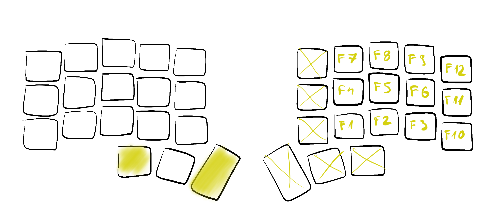

# [narf][]’s zmk config

Configuration of my Corne keyboard.


### Hardware

- five column Corne from [Typeractive][]
  - 36 keys
  - wireless
  - low profile
  - choc-spaced
  - hot-swappable
- no case, no plates, no displays — keeping it simple
- MBK Legend 40s keycaps from [splitkb][]
- linear Kailh Choc switches, also from [splitkb][]:
  - mostly silver (40gf)
  - pro red (35gf) near the outer edge
  - pink (20gf) under pinkies


### Software

- [Polemak][]: Colemak DH modified for Polish and Vim
- influenced by [Miryoku][]'s ideas and values
- home _low_ mods (using the index finger on the lower row for the fourth modifier instead of pinky)
- optimized for non-typing with just the left hand — with the right hand on the mouse/glass/... I can:
  - open specific apps
  - change tabs
  - copy, paste, close, reopen, undo, redo, ...
  - navigate system popups (tab, shift+tab, space, enter, esc)
  - call a fair amount of git commands (thanks to my short [aliases][git config])
  - quit CLI programs (ctrl+c, ctrl+d)
  - ...


## Layers

Images have not been updated [for a while](https://github.com/narfdotpl/zmk-config/compare/113ec9a057dc9de4e0a4f90d7a0cd3a8a14dcf2a...master).


### Base




### Polemak

Colemak DH modified for Polish and Vim


- I write in English and Polish and I use Vim
- I started with Colemak DH (switching from QWERTY after three decades)
- swapped `J` and `K` so they're not up side down in Vim
- reorganized left bottom row for Polish:
  - in Polish `Z` is the most used consonant
  - `Q`, `V`, and `X` are not part of the alphabet
  - after my changes all `Z` digraphs are pleasant rolls: `CZ`, `DZ`, `RZ`, `SZ`
  - serendipitously, because I have `alt` on `hold R`, I can type `RZ` and `Ż` (same sound in Polish) using the same keys 🤯 just in a different rhythm
- swapped `F` and `W` so that closing windows is more convenient to me
- the whole time I was using Colemak DH [layout analysis tool][analyze] to make the layout better for Polish and not much worse for English:


### Apps and windows

Powered by [Hammerspoon][]:




### System




### Bluetooth




### Symbols and code


### Numbers




### F1–F12




## Building firmware locally

ZMK configs are designed for [building remotely using GitHub Actions][User Setup]. In my experience the remote build takes anywhere from a few minutes to an hour, depending on cloud weather, and as such is not acceptable for interactive development or experimentation. Therefore, I created a few scripts to automate building and flashing on my local machine. It takes about fourteen seconds.


### Environment

I use macOS, <strike>VS Code</strike> Cursor, and Docker Desktop. I followed the "VS Code & Docker" instructions described in the [Toolchain Setup][] section.


### Usage

```
./scripts/develop
```

1. Connect both halves to the Mac using USB-C.
2. Before flashing, reset first the right one, then the left one (volume names depend on the order).
3. Any time you save a file, the script will build and flash.


### Installation

```
cd ~/github
git clone git@github.com:narfdotpl/zmk-config.git
docker volume create --driver local -o o=bind -o type=none -o device="$HOME/github/zmk-config" zmk-config
cd zmk-config
git submodule update --init
brew install pyenv pyenv-virtualenv
pyenv install 3.11.3
pyenv virtualenv zmk-config
pyenv activate zmk-config
pip install peat
```

```
./scripts/develop
```

In the ZMK container:

```
west init -l app/
west update
```

Install [ZMK Tools][] VS Code plugin.

  [narf]: http://narf.pl
  [Typeractive]: https://typeractive.xyz
  [splitkb]: https://splitkb.com/
  [Polemak]: #polemak
  [Miryoku]: https://github.com/manna-harbour/miryoku
  [git config]: https://github.com/narfdotpl/dotfiles/blob/master/home/.config/git/config
  [analyze]: https://colemakmods.github.io/mod-dh/analyze.html
  [Hammerspoon]: https://github.com/narfdotpl/dotfiles/blob/master/home/.hammerspoon/init.lua
  [User Setup]: https://zmk.dev/docs/user-setup
  [Toolchain Setup]: https://zmk.dev/docs/development/setup
  [ZMK Tools]: https://marketplace.visualstudio.com/items?itemName=spadin.zmk-tools
