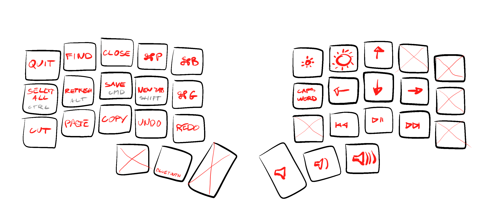
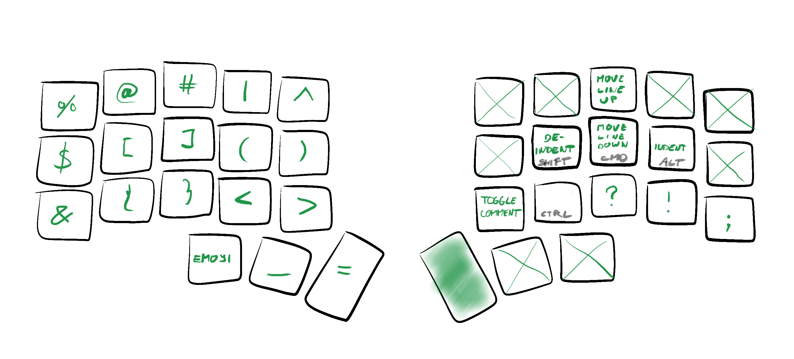

# [narf][]’s zmk config

Configuration of my Corne keyboard.

_Early WIP_


## Layers

_Not everything is fully implemented yet_


### Base


### Colemak DH mods for Polish and Vim (Polemak?)


### Hyper


### Media




### Bluetooth


### Symbols




## Building firmware locally

ZMK configs are designed for [building remotely using GitHub Actions][User Setup]. In my experience the remote build takes anywhere from a few minutes to an hour, depending on cloud weather, and as such is not acceptable for interactive development or experimentation. Therefore, I created a few scripts to automate building and flashing on my local machine.


### Environment

I use macOS, VS Code, and Docker Desktop. I followed the "VS Code & Docker" instructions described in the [Toolchain Setup][] section.


### Usage

```
./scripts/develop
```

1. Connect both halves to the Mac using USB-C.
2. Before flashing, reset first the right one, then the left one (volume names depend on the order).
3. Any time you save a file, the script will build and flash.


### Installation

```
cd ~/github
git clone git@github.com:zmkfirmware/zmk.git
git clone git@github.com:narfdotpl/zmk-config.git
docker volume create --driver local -o o=bind -o type=none -o device="$HOME/github/zmk-config" zmk-config
brew install pyenv pyenv-virtualenv
pyenv install 3.11.3
pyenv virtualenv zmk-config
pyenv activate zmk-config
pip install peat
```

Install [ZMK Tools][] VS Code plugin.

  [narf]: http://narf.pl
  [User Setup]: https://zmk.dev/docs/user-setup
  [Toolchain Setup]: https://zmk.dev/docs/development/setup
  [ZMK Tools]: https://marketplace.visualstudio.com/items?itemName=spadin.zmk-tools
